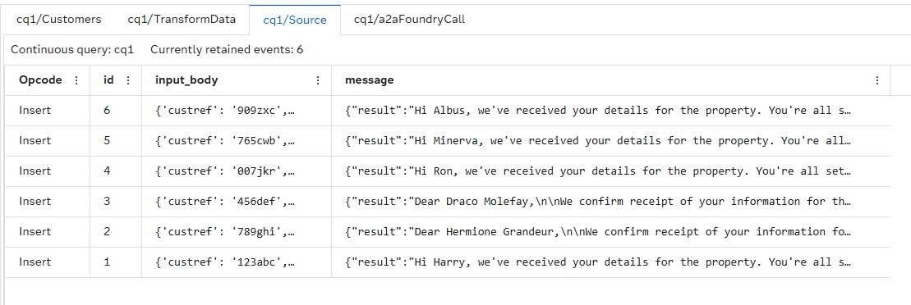
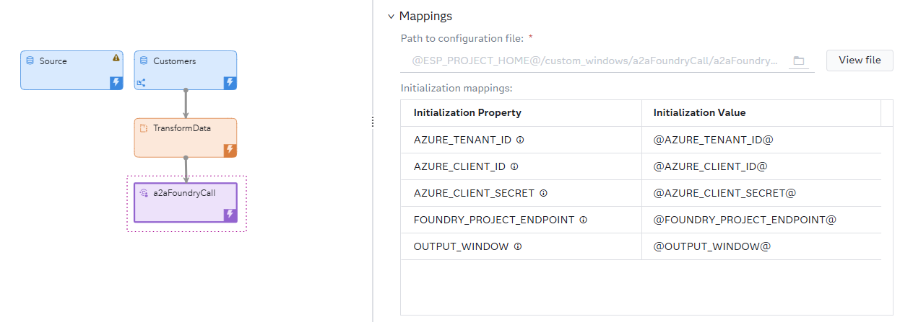

# Agent2Agent Azure Foundry Call Custom Window

## Overview
This custom window connects SAS Event Stream Processing directly to an Azure AI Foundry agent using the [Agent2Agent (A2A) protocol](https://a2a-protocol.org/latest/topics/what-is-a2a/). This protocol is an open standard that enables agents to exchange structured tasks and artifacts instead of raw chat turns. The window sends each incoming event to the Azure AI Foundry agent as a task and publishes the agent's reply to the project as a new event. The new event goes into a separate Source window with no extra connectors or glue code required.

A2A differs from an API call to a Large Language Model (LLM) in a few important ways:
- Structured tasks instead of raw text: Each request is a task with metadata (for example, IDs, context, and correlation info) and the reply is returned as a formal artifact, so you get consistent, machine-readable responses instead of parsing free-form text.
- Agent logic remains in Azure AI Foundry: The agent's skill selection, guardrails, tool usage, and prompts are managed in Azure AI Foundry rather than in the ESP project. Updating the agent does not require republishing the ESP project.
- Designed for asynchronous event-driven systems: A2A supports long-running, independent tasks. This design aligns with how ESP windows publish events and avoids a single blocking request-response call.

This window is ideal for sending enrichment, classification, or generative AI tasks from SAS Event Stream Processing to a governed AI agent without requiring changes to the rest of your streaming pipeline.

> [!NOTE]
> To minimize cost, keep the number of calls made to the agent as low as possible. Be careful about what data you share with the agent.

## Example Output
Here is an example of Azure Foundry agent responses that flow back into an ESP project as new events. Each `message` is a reply from the agent.



## Installation
To install the A2A window, upload the `custom_window.py` configuration file to SAS Event Stream Processing Studio. For more information, see [Upload a Configuration File](https://documentation.sas.com/?cdcId=espcdc&cdcVersion=default&docsetId=espstudio&docsetTarget=n1s1yakz9sl8upn1h9w2w7ba2mao.htm#p0a64jblkf46y4n1hofcs1ikonrz).

## Quick Start
If you have not published an Azure AI Foundry agent yet, see [AZURE_FOUNDRY_A2A_SETUP.md](./AZURE_FOUNDRY_A2A_SETUP.md) for step-by-step instructions about how to set up an agent and app registration so that you can use it with this A2A window.

To get started, try the A2A window with the [Python Compute](https://github.com/sassoftware/esp-studio-examples/tree/main/Transformations/python_compute) example. You can add the A2A window to the end of the project and connect the TransformData window to it. Every event that leaves TransformData is forwarded to your agent, and the agent's response is published as a new event to the Source window that you configure.



1. Select the A2A window.
2. Expand **Mappings**. In the **Initialization mappings** table, define your Azure and Foundry values. Use [User-Defined Properties](https://go.documentation.sas.com/doc/en/espcdc/default/espstudio/p1jz00de0x0kvhn1sgmllwhalkmq.htm) to keep secrets out of the window configuration and enable different values to be used for each environment without modifying the project.
3. The custom window does not change the schema. Click , and then click  to copy all fields from the upstream window to this window's output schema.
> [!NOTE]
> The window sends each event and immediately continues processing subsequent events. Agent replies arrive asynchronously and are published to your chosen output window whenever the agent responds. Replies might not arrive in the same order in which requests were sent.

### Output Source Window
Before you run the project, create the Source window that receives agent replies. For more information, see [Create the Output Source Window](#create-the-output-source-window).

### Run the Project
After you configure the A2A and Source windows, you can [test the project](https://go.documentation.sas.com/doc/en/espcdc/default/espstudio/p1xzbzbnvpspodn1h2jkzo9m9t7d.htm). In the [Example Output](#example-output) section, you can find an example of the output that the A2A window produces. The Azure AI Foundry agent responses flow back into an ESP project as new events. Each row is one reply from the agent that corresponds to an event sent by the window.

> [!NOTE]
> Azure AI Foundry agents currently support only text. Image, audio, or other binary content in an event is not sent to or returned from the agent.

## Create the Output Source Window
The A2A window publishes agent replies to a Source window. Identify the Source window by setting the `OUTPUT_WINDOW` initialization property in the A2A window. The target Source window must already exist in the project before the A2A window runs. The A2A window does not create it for you.

1. In the **Windows** pane, expand **Input Streams**.
2. Add a Source window to your project.
3. Select the Source window, and then click .
4. Copy and paste the following code into the window. Replace **name="Source"** with the Source window name that you plan to use for `OUTPUT_WINDOW`.

   ```xml
    <window-source name="Source">
      <schema>
        <fields>
          <field name="id" type="int64" key="true"/>
          <field name="input_body" type="rstring"/>
          <field name="message" type="string"/>
        </fields>
      </schema>
    </window-source>
   ```

After the Source window is configured, the A2A window can publish each agent response into that window. If necessary, add more windows to process the result further.

## Usage
Before you use this custom window, create the Source window that receives agent replies. For more information, see [Create the Output Source Window](#create-the-output-source-window).

The incoming event is sent to the Azure AI Foundry agent as-is. The output schema should match the upstream window schema. The Azure AI Foundry agent's reply is delivered separately as a new event published to the Source window specified in `OUTPUT_WINDOW`.

> [!NOTE]
> The Azure and Foundry initialization values in this section come from your published agent and app registration. If you still need to create those resources, see [AZURE_FOUNDRY_A2A_SETUP.md](./AZURE_FOUNDRY_A2A_SETUP.md).
### Initialization Mappings
Set the following properties in the A2A window. It is recommended to use [User-Defined Properties](https://go.documentation.sas.com/doc/en/espcdc/default/espstudio/p1jz00de0x0kvhn1sgmllwhalkmq.htm) to keep secrets out of the window configuration and enable different values to be used for each environment without modifying the project:

| Name                       | Description                                                                                                          | Default      |
|:---------------------------|:---------------------------------------------------------------------------------------------------------------------|:-------------|
| `AZURE_TENANT_ID`          | The Directory (tenant) ID of the Microsoft Entra ID application registration created for this agent.                 | _no default_ |
| `AZURE_CLIENT_ID`          | The Application (client) ID of the Microsoft Entra ID application registration created for this agent.               | _no default_ |
| `AZURE_CLIENT_SECRET`      | The client secret value generated under **Certificates & secrets** for the application registration.                 | _no default_ |
| `FOUNDRY_PROJECT_ENDPOINT` | The A2A endpoint copied from the published agent's Details page in Azure AI Foundry.                                 | _no default_ |
| `OUTPUT_WINDOW`            | The ESP window that receives the agent's response as a new event (for example, cq1/Source1).                         | cq1/Source   |

## Next Steps
- Add support for including request-response metadata (for example, skill used, token cost, and correlation ID) directly on the output event
- Add SAS Retrieval Agent Manager (RAM) agent integration
- Add support for adding messages to the same conversation. For example, if sensor XYZ has an issue and then has an issue again at a later time, the AI agent would remember the earlier issues.
