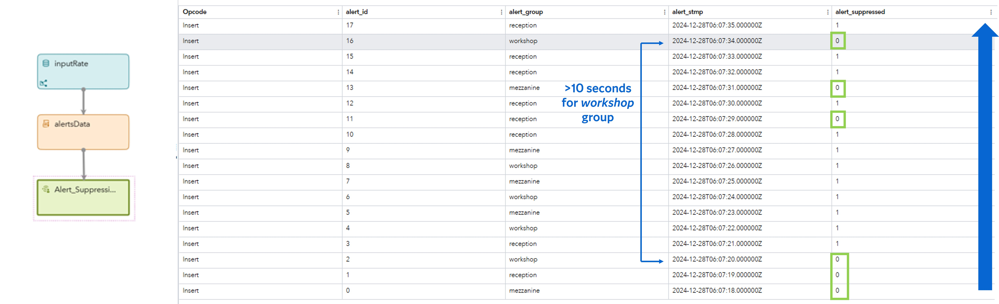

# Alert Suppression Custom Window
Alert suppression automatically suppresses output alerts based on the allowed frequency settings. This helps minimize redundant communications with the client, reduce the load on investigation tools, and eliminate duplicate alerts.

Depending on the use case, it is necessary to consider where the window should store data on temporary retention of alerts: either you store the data inside the window itself, in which case the retention works only within the ESP project and dedicated pod, or you use an external cache.

## Decision Logic without an External Cache
Schema for `USE_EXTERNAL_CACHE==0`:

When an alert arrives, the Alert Suppression custom window checks whether it is the first alert in the suppression period. If it is the first alert, then the alert is passed on. If it is not the first alert, then the alert is removed or marked as suppressed, and the alert is saved to the log.

## Decision Logic with an External Cache 
Schema for `USE_EXTERNAL_CACHE==1`:

> [!NOTE]
> Cache retrieval and update operations are not part of the Alert Suppression custom window. These tasks are assumed to be performed by SAS Event Stream Processing StateDB Reader and StateDB Writer windows. See the [example with Redis cache](./test_files/alerts_suppression_redisV1.xml) for details. 
  
## Mode Comparison

| Feature or Window Mode            | No External Cache            | Use External Cache            |
|:----------------|:-----------------------|:-----------------------|
| High availability|No|Yes|
| Kubernetes autoscaling|No|Yes|
| Share same alert_group between projects|No|Yes|

## Installation
Upload the `alert_suppression.lua` configuration file to SAS Event Stream Processing Studio. For more information, see [Upload a Configuration File](https://documentation.sas.com/?cdcId=espcdc&cdcVersion=default&docsetId=espstudio&docsetTarget=n1s1yakz9sl8upn1h9w2w7ba2mao.htm#p0a64jblkf46y4n1hofcs1ikonrz) in SAS Help Center. 

## Example Output

> [!TIP]
> As an option for testing, you can use SAS ESP project [example](./test_files/alerts_suppression_no_cacheV1_1.xml) from this repository.

## Usage

<!--start_of_usage-->
### Input Variables
The only required input variable is a unique `alert_id` input variable. However, it is recommended that the `alert_group` input variable is also assigned.

| Name                       | Description                                                                 | Required or Optional   |
|:---------------------------|:----------------------------------------------------------------------------|:-----------------------|
| `alert_id`                   | A unique alert key. This input variable is also used as a key field in the output schema.                       | Required               |
| `alert_group`                | Alert group identifier. If this input variable is missing, the `default` group is assigned and a warning message is written to the log.                              | Optional               |
| `alert_stmp`                 | The name of the input field that contains the alert timestamp data. The field be set in the `ALERT_TIME_FIELD` initialization setting. If the field is missing, system time is used and an informational message is written to the log.                   | Optional               |
| `alert_group_stmp`           |  The latest timestamp when an alert was sent within the group. This input variable is required only when you set `USE_EXTERNAL_CACHE == 1`.  | Optional               |

### Output Variables
The main purpose of the Alert Suppression custom window is to add a calculated flag called `alert_suppressed`, that is equal to `1` or `0`, to the output events. The rest of the fields are propagated from the input fields without changes.

| Name            | Description            |
|:----------------|:-----------------------|
| `alert_id` | Propagated from input |
| `alert_group` | Propagated from input |
| `alert_stmp` | Propagated from input |
| `alert_suppressed` | Alert suppression flag (int64) |

### Initialization
Set the options for the custom window. 

| Name                   | Description                                                          | Default   |
|:-----------------------|:---------------------------------------------------------------------|:----------|
| `ALERT_TIME_FIELD`   | The name of a time field (string) from the input event schema to use for calculating the suppression period. If not set or the field name does not exist in the event metadata, the system time is used instead.  | `alert_stmp`      |
| `SUPPRESSION_PERIOD`  | The number of seconds (an integer) after which all alerts should be suppressed after the first alert. The suppression period works for a unique `alert_group` input variable. When the period ends, the first new event passes, and the suppressed period is renewed. | `10`       |
| `USE_EXTERNAL_CACHE` | Where to store the suppression period state. If set to `0`, the state is stored only in the Lua window of current ESP project. If set to `1`, the current state comes as the `alert_group_stmp` field from the input window, and the project is stateless and autoscalable. The cache can be stored in any persistent storage. It is recommended that you implement the cache using Redis (see the [ESP project example](./test_files/alerts_suppression_redisV1.xml))   | `0`        |
| `OUTPUT_SUPPRESSED_EVENTS`            | Output suppressed events from the window (with `alert_suppressed == 1`).                                                  | `1`         |
| `LOG_SUPPRESSED_EVENTS`  | Write all suppressed events to the pod log. | `1`       |
| `MIN_COUNT`[^1] | Allowed minimum number of alerts in a given `alert_group` in the last `COUNT_INTERVAL` seconds. A value of `0` or no value means that this option is disabled.                                           | `2`         |
| `COUNT_INTERVAL`[^1]            | The number of seconds during which the number of alerts in the `alert_group` is counted and compared to the `MIN_COUNT` value. If the value is lower, the alert is suppressed. A value of `0` or no value means that this option is disabled.                                                  | `10`         |
<!--end_of_usage-->

[^1]: USE_EXTERNAL_CACHE is not supported yet for these options.

## Development

### Real-life Test
This custom window has been tested using the [example](./test_files/alerts_suppression_no_cacheV1_1.xml). 

### Future Ideas
- Add external cache support for enabled `MIN_COUNT` option
