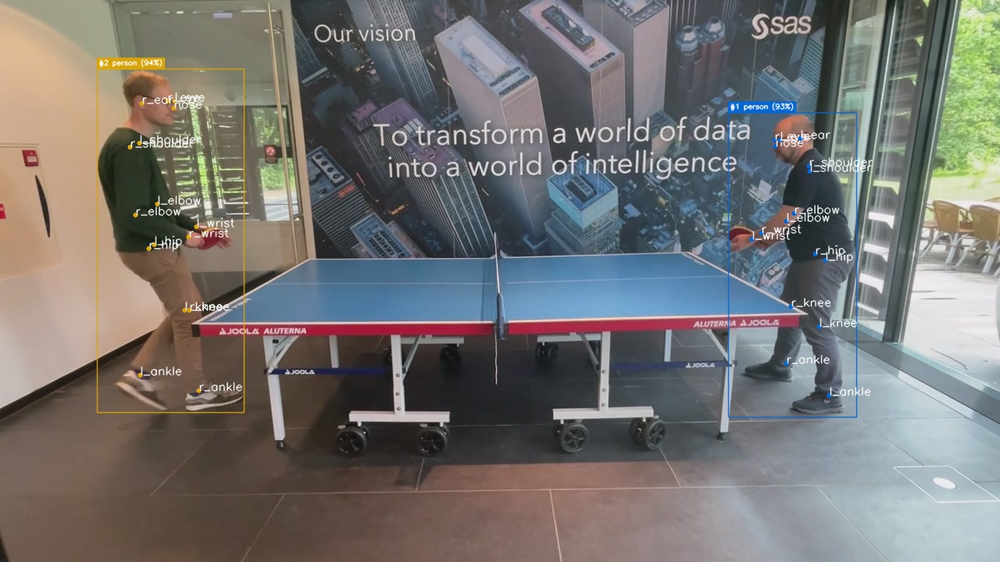

# Computer Vision Annotation custom window

This custom window allows you to annotate the results of an object detection or a pose / keypoint detection model. This allows you to visualize the results of the model. The custom window annotates the bounding boxes of object detections and adds circles for the keypoints. For object detections, the custom window also displays the detected class and probability. If object tracking information is available, the object ID is also displayed. Each object ID is displayed in a different color.

### Installation
Import `annotation.py` in the Custom Window tab. 

## Example output



## Usage

<!--start_of_usage-->
### Input variables
Image and object detection related fields are required, keypoints are optional. Object ID (for object tracking) and attributes are also optional.

| Name                       | Description                                                                 | Optional   |
|:---------------------------|:----------------------------------------------------------------------------|:-----------|
| image                      | Input image (blob)                                                          |            |
| label                      | Delimited list containing the class of the detected objects (string)        |            |
| x                          | Top-left X-coordinates of the bounding boxes (array(dbl))                   |            |
| y                          | Top-left Y-coordinates of the bounding boxes  (array(dbl))                  |            |
| w                          | Widths of the bounding boxes (array(dbl))                                   |            |
| h                          | Heights of the bounding boxes (array(dbl))                                  |            |
| score                      | Confidence scores array (array(dbl))                                        |            |
| object_id                  | Tracked object ID, e.g., from the Object Tracker window (array(i32))        | Yes        |
| attribute                  | Delimited list containing the attribute(s) of the detected objects (string) | Yes        |
| object_track_count         | Number of tracks per detected object (array(i32))                           | Yes        |
| object_track_kpts_count    | Number of keypoints per detected object for the track (array(i32))          | Yes        |
| object_track_kpts_x        | X-coordinates for the keypoints track (array(dbl))                          | Yes        |
| object_track_kpts_y        | Y-coordinates for the keypoints track (array(dbl))                          | Yes        |
| object_track_kpts_score    | Confidence scores for the keypoints track (array(dbl))                      | Yes        |
| object_track_kpts_label_id | Label IDs for the keypoints track (array(i32))                              | Yes        |

### Output variables
Add a blob output field to store the annotated image. If you use the same image as used in the input variables, the original image will be overwritten with an annotated image.

| Name            | Description            |
|:----------------|:-----------------------|
| annotated_image | Annotated image (blob) |

### Initialization
Set the options for the custom window. Note that either png or jpg is needed as output_image_encoding to display images in Grafana.

| Name                   | Description                                                           | Default   |
|:-----------------------|:----------------------------------------------------------------------|:----------|
| input_image_encoding   | Input image encoding - must be either: wide, jpg, png (default: wide) | wide      |
| output_image_encoding  | Output image encoding - must be either: wide, jpg, png (default: jpg) | jpg       |
| object_label_separator | Object label separator                                                | ,         |
| kpts_labels            | Keypoint labels                                                       |           |

<!--end_of_usage-->

An example value for kpts_labels would be `nose,l_eye,r_eye,l_ear,r_ear,l_shoulder,r_shoulder,l_elbow,r_elbow,l_wrist,r_wrist,l_hip,r_hip,l_knee,r_knee,l_ankle,r_ankle` for YOLOv7 Pose

## Development

### Real-life test
This custom window has been tested using the [Pose Estimation Using an ONNX Model (YOLO Pose Version 7)](https://github.com/sassoftware/esp-studio-examples/tree/main/Advanced/onnx_pose_estimation) example. 

### Unit tests

In the root directory, run

```
python -m unittest discover -v -b
```

The `test_output/` folder will contain the output of the tests.

### Docstrings

The docstrings are formatted with `pydocstringformatter`.

- Install: `pip install --upgrade pydocstringformatter`
- Usage: `pydocstringformatter -w --no-final-period --no-capitalize-first-letter *.py`


### Future ideas
- Write outcomes to JPG or MP4, but that's more something for a subscriber connector