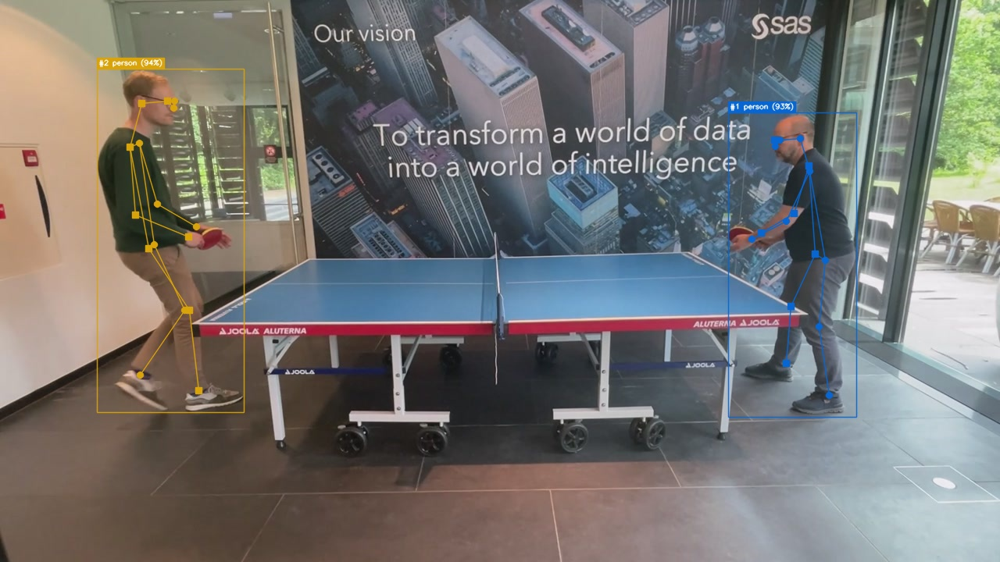
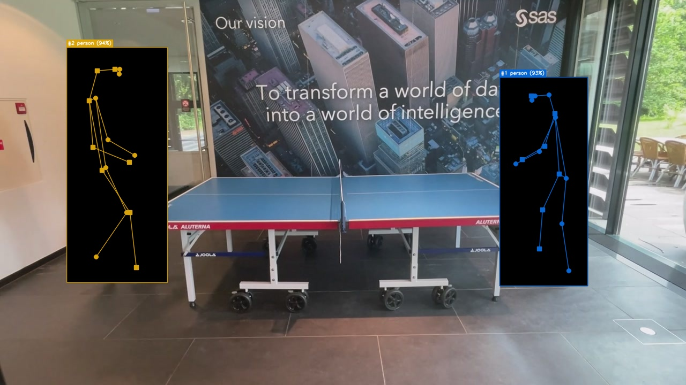

# Computer Vision Annotation Custom Window

This custom window annotates the output of object detection and pose estimation models for visualization in SAS Event Stream Processing. It renders:

- **Bounding boxes** with class labels and confidence scores for detected objects
- **Keypoints** as circles (left body parts) and rectangles (right body parts) connected by skeleton lines
- **Object tracking IDs** with unique colors when tracking data is available
- **Attributes** for detected objects when provided

**Privacy protection** is available through optional pseudonymization that fills bounding boxes with black rectangles.

## Installation

Upload the `annotation.py` configuration file to SAS Event Stream Processing Studio. For more information, see [Upload a Configuration File](https://documentation.sas.com/?cdcId=espcdc&cdcVersion=default&docsetId=espstudio&docsetTarget=n1s1yakz9sl8upn1h9w2w7ba2mao.htm#p0a64jblkf46y4n1hofcs1ikonrz) in SAS Help Center.

## Example Output



### Pseudonymization (black_bbox)



## Usage

<!--start_of_usage-->
### Input Variables
Fields for image and object detection are required. Keypoints, object tracking, and attributes are optional.

| Name                         | Description                                                  | Type                  | Required or Optional   |
|:-----------------------------|:-------------------------------------------------------------|:----------------------|:-----------------------|
| `image`                      | Input image                                                  | `blob`                | Required               |
| `label`                      | Delimited list containing the class of the detected objects  | `string` or `rstring` | Required               |
| `x`                          | Top left X-coordinates of the bounding boxes                 | `array(dbl)`          | Required               |
| `y`                          | Top left Y-coordinates of the bounding boxes                 | `array(dbl)`          | Required               |
| `w`                          | Widths of the bounding boxes                                 | `array(dbl)`          | Required               |
| `h`                          | Heights of the bounding boxes                                | `array(dbl)`          | Required               |
| `score`                      | Confidence scores array                                      | `array(dbl)`          | Required               |
| `object_id`                  | Unique object IDs from tracking, e.g., Object Tracker window | `array(i32)`          | Optional               |
| `attribute`                  | Delimited list of object attributes                          | `string` or `rstring` | Optional               |
| `object_track_count`         | Number of tracks per detected object                         | `array(i32)`          | Optional               |
| `object_track_kpts_count`    | Number of keypoints per detected object for the track        | `array(i32)`          | Optional               |
| `object_track_kpts_x`        | X-coordinates for the keypoints track                        | `array(dbl)`          | Optional               |
| `object_track_kpts_y`        | Y-coordinates for the keypoints track                        | `array(dbl)`          | Optional               |
| `object_track_kpts_score`    | Confidence scores for the keypoints track                    | `array(dbl)`          | Optional               |
| `object_track_kpts_label_id` | Label IDs for the keypoints track                            | `array(i32)`          | Optional               |

### Output Variables
Define an output field of type `blob` to store the annotated image. **Note:** If you use the same field name as your input image, the original will be overwritten.

| Name              | Description     | Type   |
|:------------------|:----------------|:-------|
| `annotated_image` | Annotated image | `blob` |

### Initialization
Configure the custom window options. **Important:** Use `png` or `jpg` for `output_image_encoding` to display images in Grafana. Use `wide` for optimal performance when staying within ESP.

| Name                     | Description                                                                                    | Default   |
|:-------------------------|:-----------------------------------------------------------------------------------------------|:----------|
| `input_image_encoding`   | Input image encoding - must be one of the following: `wide`, `jpg`, `png`                      | `wide`    |
| `output_image_encoding`  | Output image encoding - must be one of the following: `wide`, `jpg`, `png`                     | `jpg`     |
| `pseudonymization`       | Pseudonymization setting - must be one of the following: `none`, `black_bbox`                  | `none`    |
| `object_label_separator` | Object label separator                                                                         | `,`       |
| `kpts_labels`            | Keypoint labels, comma separated, in the order of the label IDs. For example: `nose,l_eye,...` | ``        |
| `skeleton`               | Skeleton definition for keypoints. For example: `nose-l_eye,nose-r_eye,...`                    | ``        |
| `show_keypoint_labels`   | Whether to show keypoint labels or not                                                         | `no`      |

<!--end_of_usage-->

### Example Values

#### YOLOv7 Pose Configuration

**Keypoint Labels:**
```
nose,l_eye,r_eye,l_ear,r_ear,l_shoulder,r_shoulder,l_elbow,r_elbow,l_wrist,r_wrist,l_hip,r_hip,l_knee,r_knee,l_ankle,r_ankle
```

**Skeleton Connections:**
```
nose-l_eye,nose-r_eye,l_eye-r_eye,l_eye-l_ear,r_eye-r_ear,l_ear-l_shoulder,r_ear-r_shoulder,l_shoulder-r_shoulder,l_shoulder-l_elbow,l_shoulder-l_hip,r_shoulder-r_elbow,r_shoulder-r_hip,l_elbow-l_wrist,r_elbow-r_wrist,l_hip-r_hip,l_knee-l_hip,r_knee-r_hip,l_ankle-l_knee,r_ankle-r_knee
```

## Development

### Real-life Test

This custom window has been tested using the [Pose Estimation Using an ONNX Model (YOLO Pose Version 7)](https://github.com/sassoftware/esp-studio-examples/tree/main/Advanced/onnx_pose_estimation) example.

### Unit Tests

In the root directory, run

```
python -m unittest discover -v -b
```

The `test_output/` folder will contain the output of the tests.

### Docstrings

The docstrings are formatted with `pydocstringformatter`.

- Install: `pip install --upgrade pydocstringformatter`
- Usage: `pydocstringformatter -w --no-final-period --no-capitalize-first-letter *.py`


## Troubleshooting

### Common Issues

**Images not displaying properly:**
- Ensure `output_image_encoding` matches downstream requirements
- For Grafana: use `png` or `jpg` encoding

**Keypoints not appearing:**
- Verify `kpts_labels` and `skeleton` configurations match your model
- Check that keypoint data arrays have consistent lengths
- Ensure `show_keypoint_labels` is set to `yes` if you want labels visible

**Performance issues:**
- Use `wide` encoding for fastest processing
- Consider reducing image resolution for real-time applications
- Monitor memory usage with large images or high frame rates


### Video Output Integration

Add a [Video Capture subscriber](https://go.documentation.sas.com/doc/en/espcdc/default/espca/videocaptureca.htm) to save annotated frames as MP4. For example:
```xml
<connector class="videocap" name="sub_video" active="true">
    <properties>
        <property name="type"><![CDATA[sub]]></property>
        <property name="snapshot"><![CDATA[false]]></property>
        <property name="outputtimebase"><![CDATA[30]]></property>
        <property name="imagefieldname"><![CDATA[annotated_image]]></property>
        <property name="filename"><![CDATA[@ESP_PROJECT_OUTPUT@/annotated_video.mp4]]></property>
        <property name="outputformat"><![CDATA[mp4]]></property>
        <property name="outputcodec"><![CDATA[h264]]></property>
        <property name="bitrate"><![CDATA[4.5]]></property>
    </properties>
</connector>
```
