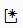
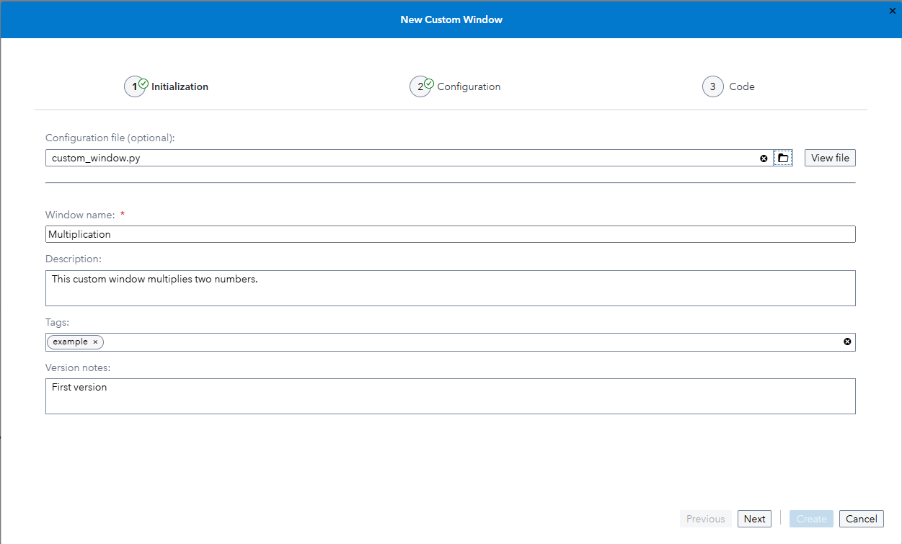
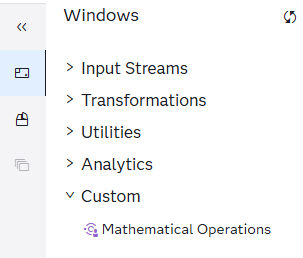
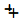
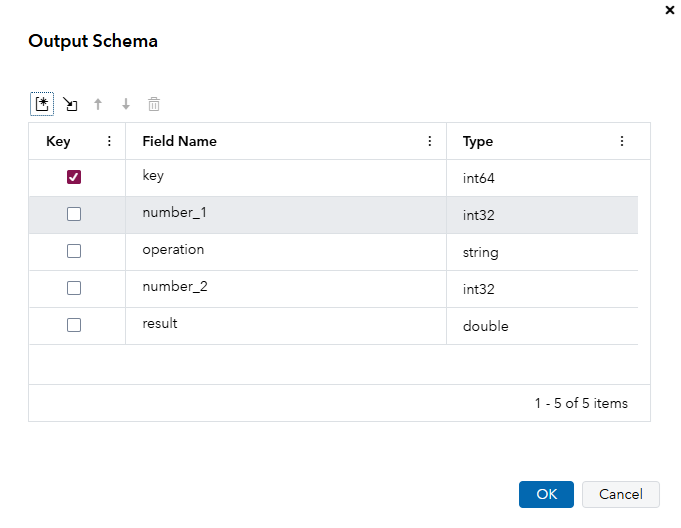
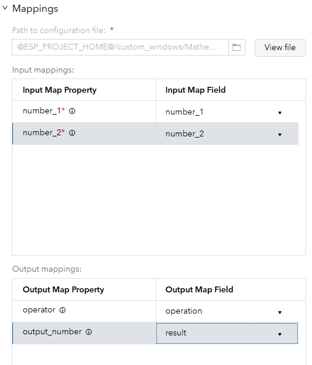
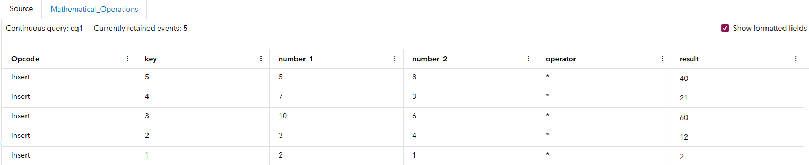
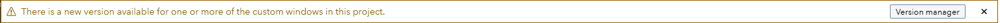
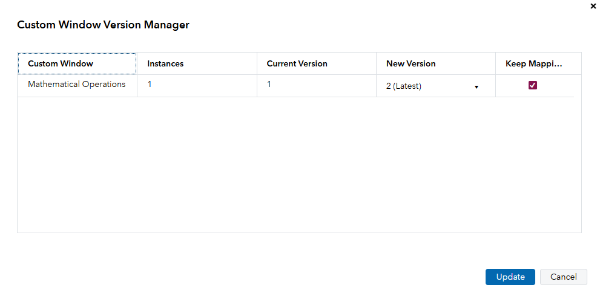
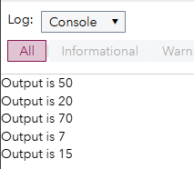

# Getting Started
This example demonstrates how a developer can create a simple custom window that takes two numbers as input and applies the selected mathematical operation to them. You also learn how an end user can use the custom window in a project and update the custom window after a developer has made further changes to the window's configuration. 

## Create a Custom Window in SAS Event Stream Processing Studio

This section demonstrates how a developer creates a custom window.

### Open the Wizard
1. Download the file [custom_window.py](custom_window.py) to your computer. This file contains the custom window metadata, input and output mappings, and code. 
2. In SAS Event Stream Processing Studio, click **Custom Windows** on the navigation bar.
3. On the Custom Windows page, click . A wizard with three pages appears. 

### Page 1 - Initialization
Use the **Configuration file** field to select the file that you downloaded. This populates the fields throughout the wizard. For example, on the first page of the wizard, the following fields are populated for you: the window name, description, tags, and version notes for the custom window. 



### Page 2 - Configuration
On the **Configuration** page, you use the **Settings**, **Input Variables**, **Output Variables**, and **Initialization** tabs to define the custom window. 

#### Settings
In the **Settings** tab, the following attributes can be set: 
* `expand_parms` - When this setting is not selected, use `data` and `context` as arguments in the `create` function. When this setting is selected, the `create` function uses the input variables' names directly. 
* `process_blocks` - When this setting is selected, the window receives event blocks instead of individual events.
* `encode_binary` - When this setting is selected, Base64 encoding is used to encode binary data.

For more information, see [Using Python Windows](https://go.documentation.sas.com/doc/en/espcdc/default/espcreatewindows/p0e7tn8o6onj93n11vu60llatasz.htm). 

In this example, input parameters are expanded, so  `expand_parms` is selected. 

#### Input Variables
This example uses two input variables. These numbers are the input for the mathematical operation. Descriptions are added so that the end user knows what to enter. 

#### Output Variables
This example uses two output variables. One is the mathematical operator and the other is the result of applying the operator to the input numbers.

#### Initialization
In this example, the **Initialization** tab contains an operator field which a dropdown list populated with the 4 supported mathematical operations: addition, subtraction, multiplication and division. The default selected operation is multiplication.

### Page 3 - Code
The **Code** page is used to define the Python or Lua code that runs in the custom window. In this example, Python is used. The `create` function specifies the code. `number_1` and `number_2` are the arguments to this function because `expand_parms` was enabled on the **Settings** page of the wizard.

The code must return a dictionary where the key names match the output variable names defined on the **Configuration** page. This process is very similar to using Python windows. 

Click **Create** to create the custom window. The custom window is now available for everyone to use. 

## Use the Custom Window in a Project
Now that the custom window has been created, an end user can use it in a project.

1. Create a new project. In the New Project window, ensure that the **Create a project package** check box is checked. 
2. Create a Source window with a Python publisher connector. Use the following code, which creates an event every second. A key field called `key` is automatically generated. `number_1` and `number_2` are random numbers between one and ten. 

```xml
<window-source index="pi_EMPTY" insert-only="true" autogen-key="true" name="Source">
  <schema>
    <fields>
      <field name="key" type="int64" key="true"/>
      <field name="number_1" type="int32"/>
      <field name="number_2" type="int32"/>
    </fields>
  </schema>
  <connectors>
    <connector class="python" name="python_publisher">
      <properties>
        <property name="type"><![CDATA[pub]]></property>
        <property name="interval"><![CDATA[1 seconds]]></property>
        <property name="code"><![CDATA[import random

def publish():

    event = {}

    event['number_1'] = random.randint(1, 10)
    event['number_2'] = random.randint(1, 10)
      
    return {
        "events": event,
        "done": False
    }
]]></property>
      </properties>
    </connector>
  </connectors>
</window-source>
```

3. To add the custom window to the project, in the **Windows** pane, expand **Custom** and drag the **Mathematical Operations** custom window to the workspace. 

    

4. Connect the Source window to the Mathematical_Operations window. 

### Edit the Output Schema
1. View the output schema of the Mathematical_Operations window and click  to import all schema fields.
2. Click  and add the following two fields:
 -  `result` of type `double`
 -  `operator` of type `string`



### Edit Window Properties
Edit the properties of the Mathematical_Operations window:
1. Expand **State** and set **Window state and index** to **Stateless (pi_EMPTY)**. 
2. Expand **Mappings** and map the variables used internally by the custom window to the fields used in the project: 



A red asterisk means that a property is required. Hover over  to see the description for that field. 

Note that these variable names in the left column and the right column can be different. For example, `output_number` is used inside the custom window but is mapped to `result` in the project. 

### Test the Project
1. Save the project.
2. Click **Enter Test Mode** and then click **Run Test**
3. Check the output of the Mathematical_Operations window. 



## Updating a Custom Window
A developer might need to make a further change to an existing custom window. Following such a change, an end user can update the custom window in their project to accept the changes.

### Update the Custom Window's Configuration
1. Return to the **Custom Window** page.
2. Double-click the Mathematical Operations custom window.
3. Make your changes. For example, go to the **Code** page and add `print(f"Output is {event['output_number']}")` to the code just before the `return` statement. 
4. Click **New Version**.

### Manage Custom Window Versions in a Project
An end user can now update the custom window in their project to accept the changes:
1. Reopen the project. You are prompted to update the custom window to the latest version. 

    

2. Click **Version Manager** to open the Custom Window Version Manager window.

    

**Tip:** If you select the check box in the **Keep Mappings** column, the input, output, and initialization mappings are kept.

3. Click **Update** to update to the new version.
4. Run the project in test mode. Messages such as the following are displayed in the console log:


