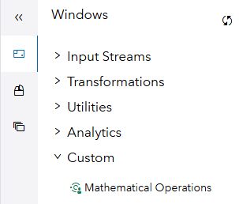
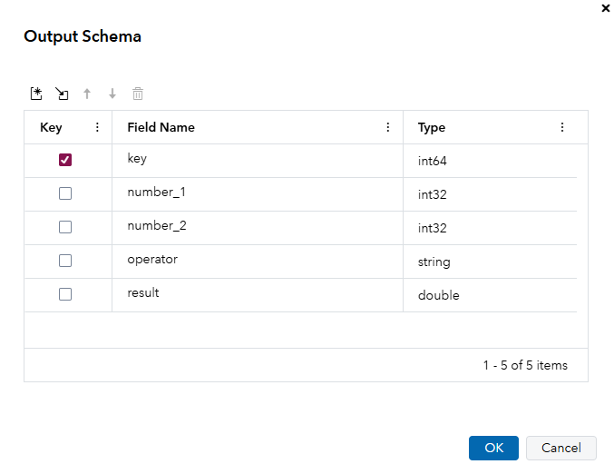

# Getting Started
In this Getting Started guide, we will show you how to create a simple custom window that takes two numbers as input and multiplies them. Then we will use this custom window in a project. Finally, we will see how to update a custom window. 

## Adding a custom window to SAS Event Stream Processing Studio
Download the file [custom_window.py](custom_window.py). This file contains the custom window metadata, input and output mappings, and code. Then, in the SAS Event Stream Processing Studio, go to the Custom Windows tab and click the *New Custom Window* icon . A three-step wizard will appear. 


### Step 1 - Initialization
In Step 1, "Initialization," for *Configuration File*, select the file you downloaded. This will populate the fields throughout the wizard. The first step prompts you for the window name, description, tags, and version notes for the custom window. 


### Step 2 - Configuration
In step 2 "Configuration", you need to set the Settings, Input variables, Output Variables and Initialization for the custom window. 

#### Settings
In Settings, the following attributes can be set: 
* `expand_parms` - when not selected, use `data` and `context` as arguments in the create function. When selected, the create function uses the input variables names directly. 
* `process_blocks` - when selected, receive event blocks instead of individual events
* `encode_binary` - Base64-encode binary data

See the [Using Python Windows documentation](https://go.documentation.sas.com/doc/en/espcdc/v_055/espcreatewindows/p0e7tn8o6onj93n11vu60llatasz.htm) for more information. 

In this case, we will expand the input parameters, so we select `expand_parms`. 

#### Input Variables
For this example, we will add two input variables. These numbers will be the input for our multiplication. Descriptions are added so that the end user knows what to enter. 

#### Output Variables
We add one output variable to store the result of the multiplication in. 

#### Initialization
This part is left blank here, but can be used to specify certain properties before events are delivered. For example, you could allow the user to specify the mathematical operation here to create a more generic window. 

### Step 3 - Code
Define the Python or Lua code to run in the custom window. In this case, Python will be used. In the `create` function we specify the code. `number_1` and `number_2` are the arguments to this function since we chose `expand_parms` earlier.

The code must return a dictionary where the key names match the output variable names defined in step 2. This process is very similar to using Python windows. 


Finally, click the blue *Create* button to create the custom window. The custom window is now available for everyone to use. 

## Using the custom window in a project
Now that we have created the custom window, let's use it in a project. To do this, we first need to create some data to work with. 

To get started, create a new project and leave *Create a project package* checked. Then create a Source window with a Python Publisher as follows: 

```xml
<window-source index="pi_EMPTY" insert-only="true" autogen-key="true" name="Source">
  <schema>
    <fields>
      <field name="key" type="int64" key="true"/>
      <field name="number_1" type="int32"/>
      <field name="number_2" type="int32"/>
    </fields>
  </schema>
  <connectors>
    <connector class="python" name="python_publisher">
      <properties>
        <property name="type"><![CDATA[pub]]></property>
        <property name="interval"><![CDATA[1 seconds]]></property>
        <property name="code"><![CDATA[import random

def publish():

    event = {}

    event['number_1'] = random.randint(1, 10)
    event['number_2'] = random.randint(1, 10)
      
    return {
        "events": event,
        "done": False
    }
]]></property>
      </properties>
    </connector>
  </connectors>
</window-source>
```
This will create an event every second. A key field called `key` is automatically generated. `number_1` and `number_2` are random numbers between 1 and 10. 

Next, add the custom window. In the Windows pane, expand Custom and you should see the Multiplication custom window. Drag it to the canvas and connect the Source window to the Multiplication window. 



### Output schema
Go to the Output schema of the window, and click on  to import all schema fields. Then, click on  and add an additional field `result` of type `int32`. 



### Properties
In the window, under State, set *Window state and index* to Stateless (pi_EMPTY). Then, in Mappings map the variables used internally by the custom window to the fields used in the ESP project: 


A red asterisk means that a property is required. Hover your mouse over the  info icon to see the description for that field. 

Note that these variable names can be different. For example, `output_number` is used inside the custom window, but is mapped to `result` in the ESP project. 

### Test
Now, save the project, click on Enter Test Mode, and check the output of the Multiplication window. 


## Updating a custom window
To update a custom window, return to the Custom Window tab. Double-click on the Multiplication custom window. Make your changes and then click the blue *New Version* button. For example, add `print(f"Output is {event['output_number']}")` to the code just before the return statement. 

If you now reopen your project, you will be prompted to upgrade to the latest version. 


Click the *Version Manager* button to open the dialog: 


Click Update to upgrade to the new version. If you select Keep Mappings, the input, output and initialization mappings will be kept. 

When you go back into test mode, you should now see messages like this in the console log:


