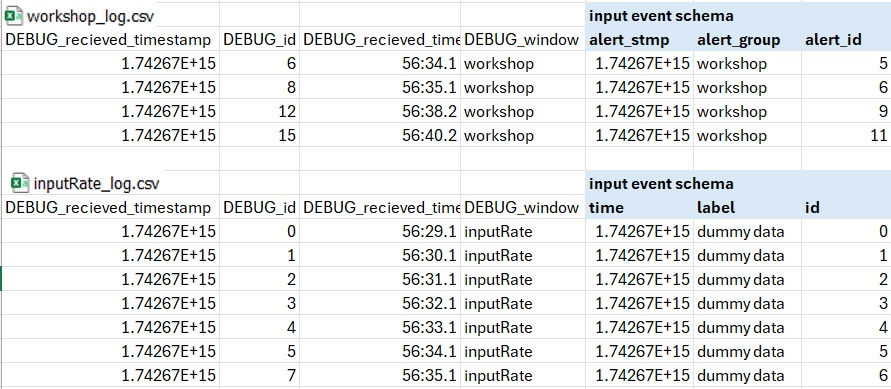
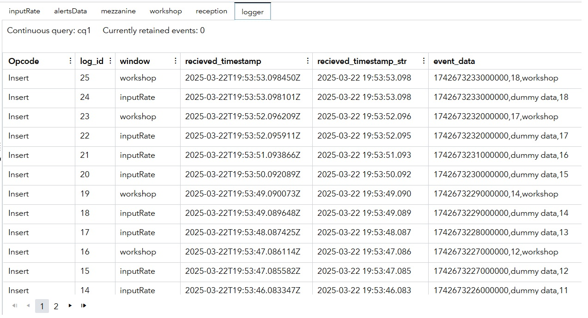

# Logger Custom Window

This custom window uses Lua and provides an easy way to debug the SAS Event Stream Processing event flow, especially in remote environments where there is no access to the input data sources and to the output data.

This window automatically saves to an output file all events from SAS Event Stream Processing windows that you select by using the `LOG_WINDOWS_LIST` project property. This eliminates the need for additional file and socket connectors in the ESP project, and can be disabled or enabled by using the `LOG_MAX_EVENTS` environment variable.
																																															 


## Installation
Import the `Logger.lua` configuration file to SAS Event Stream Processing Studio. For more information, see [Import a Configuration File](https://documentation.sas.com/?cdcId=espcdc&cdcVersion=default&docsetId=espstudio&docsetTarget=n1s1yakz9sl8upn1h9w2w7ba2mao.htm#p0a64jblkf46y4n1hofcs1ikonrz) in SAS Help Center. 

## Example Output

Here is an example of log file contents created by the Logger custom window. Both CSV files contain a fixed part from the Logger window and a dynamic part with fields from the SAS Event Stream Processing input window.  



Here is example output from the Logger custom window in SAS Event Stream Processing Studio. The dynamic part is represented in the `event_data` field.
                                   


> [!TIP]
> As an option for testing, you can use SAS ESP project [example](./test_files/event_logger.zip) from this repository.
																														  

## Usage
<!--start_of_usage-->
### Window Setup
To log events from window_A and window_B to a file:
1. In SAS Event Stream Processing Studio, connect window_A and window_B to the Logger window by using an edge. Example: ```<edge source="window_A" target="logger" />```
```<edge source="window_B" target="logger"/>```
1. Add window names to the `LOG_WINDOWS_LIST` project property. Example: ```<property name="LOG_WINDOWS_LIST"><![CDATA[window_A,window_B]]></property>```

> [!TIP]
> For advanced monitoring, you can add edges to all possibly interesting windows in your project. Later you can use the `LOG_WINDOWS_LIST` environment variable to add or remove windows from monitoring, without making changes to the project XML code, as it overrides the project property of the same name. This means that the project XML code can be suitable for pre-production testing environments.

### Initialization
Set the options for the Logger custom window as described in the following table. 

| Name                   | Description                                                          | Default   |
|:-----------------------|:---------------------------------------------------------------------|:----------|
| `LOG_MAX_EVENTS`   | The number of events to write to log files. `0` means that the logger is disabled.  | `100`      |
| `LOG_WINDOWS_LIST`  | A list of window names where to log events, separated by commas. All windows must be connected to the Logger window with an edge in the project diagram.|  _no defaults_      |
| `LOG_DIR` | The destination where the log files are to be written. If SAS Event Stream Processing does not have permissions to create and modify files in this folder, an error message is added to the SAS Event Stream Processing main log. | `@ESP_PROJECT_OUTPUT@/`         |
| `LOG_TO_SEPARATE_FILES`            | If set to `1`, a separate CSV file is created for each input window.                                               | `1`         |

> [!TIP]
> If the input windows have different schemas, it is recommended to use `LOG_TO_SEPARATE_FILES = 1`, to follow the CSV format strictly.


### Output Event
The main purpose of the Logger window is to create log files with input events from monitored windows for debugging purposes. However, in the Logger window, for each Write to the file, an event is created with the following schema.

| Name            | Description            |
|:----------------|:-----------------------|
| `log_id` | The internal log row sequence number |
| `window` | The name of the SAS Event Stream Processing input window |
| `received_timestamp` | The system timestamp of file entry creation |
| `received_timestamp_str` | The system timestamp of when the file entry was created, in human-readable string format (`"%Y-%m-%d %H:%M:%S"`)  |
| `event_data` | All input event field data, separated by commas  |

### Output File Record

The following table describes the structure of the log file.

| Name            | Description            |
|:----------------|:-----------------------|
| `LOGGER_id` | The internal log row sequence number |
| `LOGGER_window` | The name of SAS Event Stream Processing input window |
| `LOGGER_received_timestamp` | The system timestamp of file entry creation |
| `LOGGER_received_timestamp_str` | The system timestamp of when the file entry was created, in human-readable string format (`"%Y-%m-%d %H:%M:%S"`) |
| _event data fields_ | All input event field data, separated by commas  |

If `LOG_TO_SEPARATE_FILES = 1`, the generated file has the name `<LOG_DIR>/<Window_name>_log.csv`. Otherwise, all events are written to `LOG_DIR/default_log.csv`.

> [!IMPORTANT]
> The CSV HEADER is added to the output file only once.

<!--end_of_usage-->

## Development

### Future Ideas
- Add support for other log file formats
- Add log rotation
