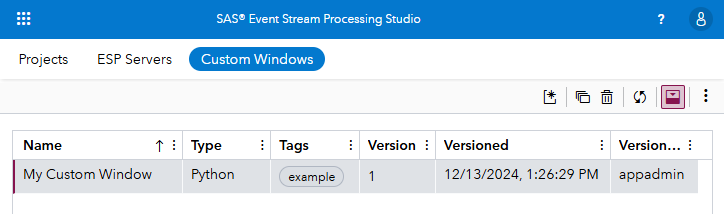
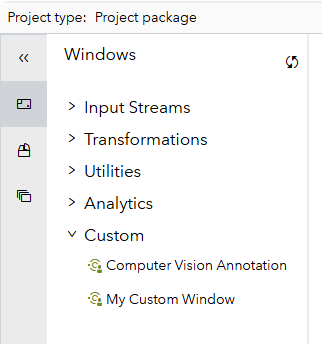
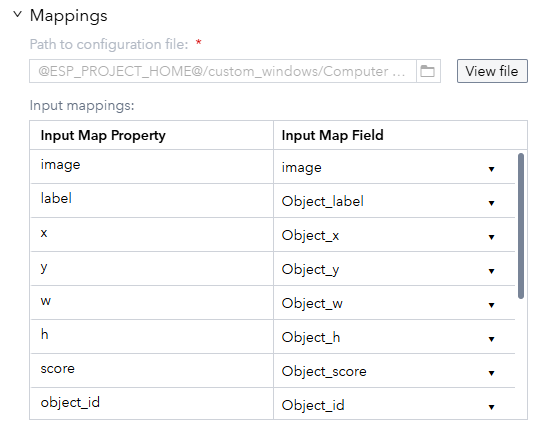

# SAS Event Stream Processing Studio Custom Windows

## Overview
Custom windows in SAS Event Stream Processing Studio allow you to create your own windows that can be reused across SAS Event Stream Processing projects. These custom windows can be written in Python or Lua. 

The end user of these custom windows can simply add them to their project and configure them, no coding required. The custom window code is added to the project package, making it portable. This means that projects that use custom windows will work on different environments, even if the custom window was not installed on that environment. 

This repository gives you access to contributed custom windows that can be imported into SAS Event Stream Processing Studio. 

<!-- ### What's new -->

### Prerequisites
SAS Event Stream Processing Studio version 2025.02 or later is required. 

## List of Contributions
[List of custom windows in this repository](CUSTOM_WINDOWS_LIST.md)

<!-- ## Installation -->

## Getting started
### Adding the custom window to SAS Event Stream Processing Studio
Download the Python or Lua code for the custom window. Then, in SAS Event Stream Processing Studio go to the Custom Windows tab and click on the *New custom window* icon. Under *Configuration file*, select the file you downloaded. Review the window name, version notes, configuration and code, and click the blue *Create* button to create the custom window. The custom window is now available for everyone to use. 

### Using the custom window in a project
When you open a project, the custom windows will be available under the Custom category. Note that you need to have a project package in order to use custom windows. 

Then, configure the output schema as well as the input, output, and initialization mappings. 

<!-- ### Running -->

<!-- ### Examples -->

<!-- ### Troubleshooting -->

## Contributing
Maintainers are accepting patches and contributions to this project.
Please read [CONTRIBUTING.md](CONTRIBUTING.md) for details on submitting contributions to this project.

## License
This project is licensed under the [Apache 2.0 License](LICENSE).

## Additional resources
* SAS Documentation on Custom Windows (TBD)
* Demo video (TBD)
